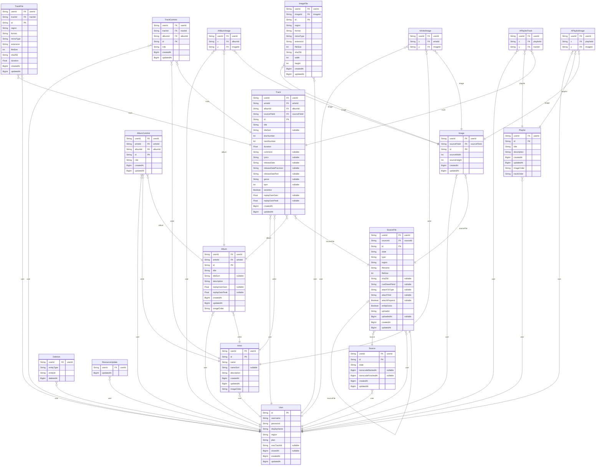
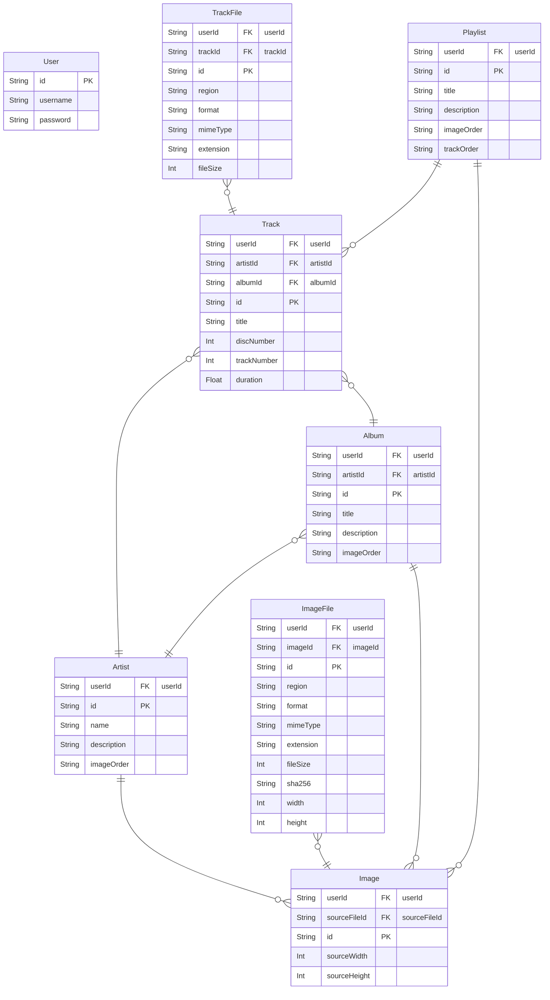

# Streamist 簡易仕様書

## アプリ名

Streamist

## 公開したアプリの URL

https://streamist.app/

デモ用アカウントとして以下の ID とパスワードでアカウントを作成してあります。

デモ用楽曲は[OtoLogic](https://otologic.jp/)のもの（CC BY 4.0）と[IMSLP](https://imslp.org/wiki/File:PMLP100782-JBrahms_Hungarian_Dance_No.5.ogg)のもの（パブリックドメイン）を使用させていただきました。
デモ用の機能制限等はしていないため、いかなる操作も行うことができることにご留意ください。
なお、認証にクロスサイト Cookie を使用するため、シークレットモードでは正常に動作しません。

## プロジェクトのリポジトリ URL

- https://github.com/SegaraRai/streamist
- https://github.com/SegaraRai/streamist/tree/recruit-fenrir

## 動作対象 OS、ブラウザ

- OS: Windows 10 以降, Android 10 以降
- ブラウザ: Google Chrome v99 以降、Mozilla Firefox v99 以降

ただし、新しめの Web 標準に準拠しているブラウザであれば動作するはずです。

## 開発環境

- Windows 10
- Google Chrome
- Visual Studio Code

## 開発言語

使用量順に記述します。

- TypeScript v4.7
- HTML (Vue.js)
- CSS
- JavaScript (ES2021 ベース)
- Shell script (bash)

## アプリケーション機能

- ユーザー登録
- 楽曲のアップロード、変換、登録
- 楽曲の管理
  - タイトル、説明等の変更
  - アーティストの変更
  - アルバムの変更
  - 削除
- プレイリストを作成・管理する
  - 名前や説明の変更
  - トラックの追加や削除
  - トラックの並び替え
  - 削除
- アーティスト単位、アルバム単位、プレイリスト単位で楽曲リストを表示・再生する
- 楽曲、アーティスト、アルバム、プレイリストを検索する
- 端末間でのリアルタイムでの再生状況の共有および操作（Spotify Connect に近い機能）

## フレームワーク、ライブラリ、ビルドツール等

- [Vite](https://vitejs.dev/) (フロントエンドビルドツール)
- [Vue.js v3.2](https://vuejs.org/) (フロントエンドフレームワーク)
- [Vuetify v3 beta](https://next.vuetifyjs.com/en/) (UI フレームワーク / ライブラリ)
- [Naive UI](https://www.naiveui.com/) (UI フレームワーク / ライブラリ)
- [Fastify](https://www.fastify.io/) (API サーバ)
- [worktop](https://github.com/lukeed/worktop) (CDN サーバ、WebSocket サーバ)

## 設計ドキュメント

### アーキテクチャ図

図中の Database は PostgreSQL です。
図中の S3 アイコンは正確には Wasabi (S3 互換ストレージサービス) です。

フロントエンドコード（静的アセット）は Cloudflare Pages にデプロイしています。
SSR は一切行っていません（純粋な SPA です）。

### ER 図

こちらの ER 図は `packages/server/prisma/schema.prisma` をほぼそのまま mermaid に書き起こしたものになります。

主要な箇所を抜粋すると以下のような形になります。
（`User`テーブルとその他各テーブルとのリレーションは見やすくするため除外しています。）

### 運用ドキュメント

デプロイや運用に必要な手順は `docs/DEVELOPMENT.md` に記載しています。

## コンセプト

手持ちの曲をどこからでも聴きたい！　という想いから生まれたサービスです。  
私は Spotify を契約しているのですが、Spotify はローカルファイル（ユーザーが持つ楽曲）の取り扱いに難があり、他の端末から再生できないという問題がありました。
いちいち端末にすべての楽曲データを保存や同期したり、アップロードしたデータに勝手に DRM がかかったりすることなく、インターネット接続さえあればどこからでも手軽に視聴できるようにしています。

## こだわったポイント

これを開発するにあたって、開発体験を良くするための労力は惜しみませんでした。
ESLint や Prettier 等のツールの導入はもとより、全編 TypeScript によるフロントエンドとバックエンドでの型の共有、[frourio](https://frourio.com/)を使用した API 型定義の共有、[GitHub Actions を用いた CI/CD](https://github.com/SegaraRai/streamist/actions) 等を実施し、高速に開発やデプロイが行えるようになりました。

アプリ本体のこだわりとしては、音声や画像のアップロード可能な形式をできるだけ増やしました（これはひとえに FFmpeg と ImageMagick のおかげです）。
私は Exact Audio Copy でリッピングすることが多かったため、CUE シートによるアルバムに対応しています。
CUE シートに対応している競合サービスは私が調べた限りではありませんでした。

変換後のフォーマットにもこだわっています。
音声は 4 種類のフォーマット（AAC MP4A 96kbps, AAC MP4A 256kbps, Opus WebA 96kbps, Opus WebA 256kbps）に変換し、環境やニーズに合わせた品質で提供しています。
これらの変換処理はすべて AWS Lambda または Google Cloud Run で実行し、スケールするようにしています。

また、利便性向上のため PWA 化も頑張りました。
Web Manifest を記述してあるため、端末にインストールして使用することができます。
ユーザーの DB データはすべてブラウザの IndexedDB に複製しているため、今後オフライン動作を実装することも可能になっています（現在は未実装です）。

最後に、可能な限り安く運用できるように頑張りました。
現在各種 IaaS、ドメイン代、サーバー代、ストレージ代を含めて、およそ月 4,100 円（他のプロジェクトと共有しているものを除くとおよそ 2,500 円）で運用しています。
オブジェクトストレージには Wasabi と呼ばれる S3 互換サービスを用いています（東京リージョンでおよそ 1 TB あたり 7 USD）。
CDN やフロントエンドのホスティング、エッジコンピューティング等には Cloudflare の無料プランを使用しています。Cloudflare Workers のみ有料版を使用しているため月 5 USD かかっています。
サーバには KAGOYA CLOUD VPS を使用し、本番環境用に 1100 円/月、ステージング環境用に 979 円/月のインスタンスを使用しています。

## デザイン面でこだわったポイント

パソコン、スマートフォン等どのような画面サイズの端末からでも快適に使用できるように、レスポンシブデザインを念頭にデザインし、開発者ツール、実機双方で検証しました。
レスポンシブデザインといえば CSS での記述がメインになるかと思いますが、CSS だけでは実現が難しい箇所についても操作性を良くするべく対応を行っています。
例えば、本アプリではメニューからトラックを直接プレイリストに追加できるのですが、スマートフォン等画面が小さい端末においてはメニューが画面からはみ出してしまう場合がありました。
これを、スマートフォン等では「プレイリストに追加」という項目にまとめ、それを選択した後改めてダイアログでどのプレイリストに追加するかを選択できるようにしました。

|                        デスクトップ端末                        |                    モバイル端末（メニュー）                     |                   モバイル端末（ダイアログ）                    |
| :------------------------------------------------------------: | :-------------------------------------------------------------: | :-------------------------------------------------------------: |
|  |  |  |

また、ライトテーマとダークテーマに対応させることも私の中のこだわりでした。
これは単純に私がダークテーマを好きなためです。

最後に、私は応答性（パフォーマンス）もデザインの一つであると考えています。
スマートフォン実機での動作確認の際、トラック数が多い場合にスクロールが重くなるという問題がありました。
現在では、仮想スクロールを導入するとともにレンダリング内容を軽量化し、改善しています。

## 自己評価

開発にはかなりの時間を要しましたが、成果物にも開発の過程で得られた知見にも満足しており、現在も自分で使用しております。
ただし、ある程度満足した結果、開発が鈍化してしまいました。
これは、ユーザーが自分だけである点が原因であると考えます。
